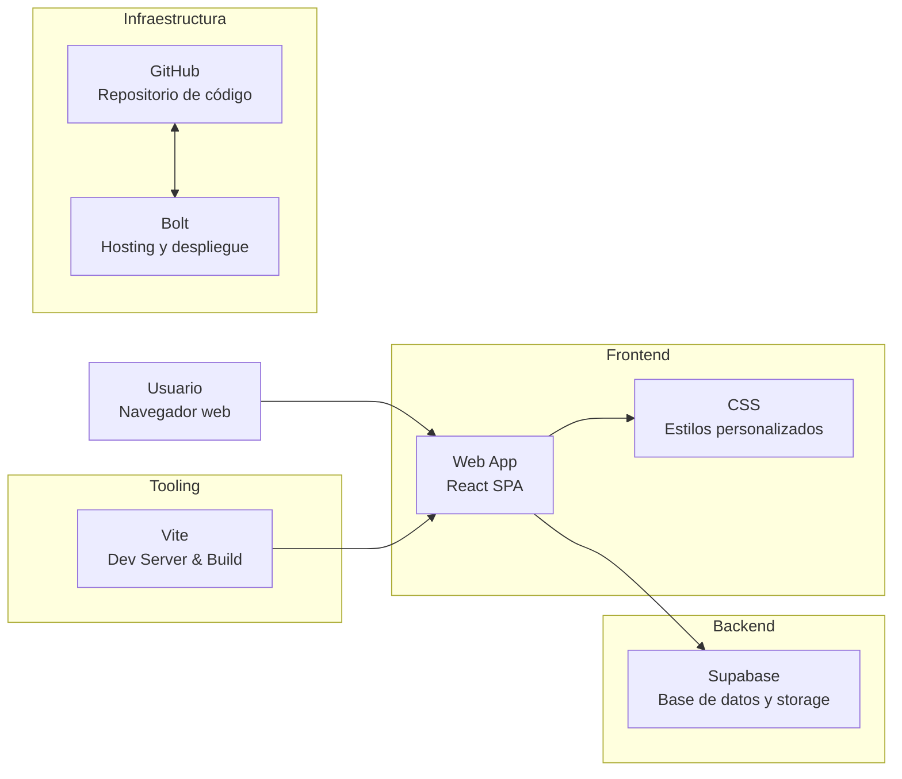

# PEREDAWEB

## Demo
- [demo](https://nicomencia-peredaweb-bb02.bolt.host)
- [qr](https://quickchart.io/qr?size=300&text=https://nicomencia-peredaweb-bb02.bolt.host)

## Arquitectura del proyecto

### Diagrama de arquitectura

### Frontend (lo que ve el usuario)

- **React**  
  Librería JavaScript para construir interfaces de usuario basadas en componentes.  
  En lugar de trabajar directamente sobre el DOM con HTML y JavaScript imperativo, React utiliza un modelo declarativo: la interfaz se describe como una función del estado, y React se encarga de actualizar solo las partes necesarias cuando los datos cambian.

  La aplicación se estructura en componentes reutilizables que encapsulan su propio marcado (JSX), lógica y estado, lo que facilita el mantenimiento, la escalabilidad y la reutilización de código.  
  Este enfoque permite una navegación fluida tipo *Single Page Application (SPA)*, evitando recargas completas de página y mejorando la experiencia de usuario.

- **Vite**  
  Herramienta moderna de desarrollo y build que actúa como servidor local y sistema de empaquetado.  
  Durante el desarrollo utiliza módulos ES nativos del navegador, lo que permite tiempos de arranque prácticamente instantáneos y recarga en caliente (*Hot Module Replacement*) muy rápida.

  Para producción, Vite se encarga de generar una versión optimizada de la aplicación:  
  - Minificación de código  
  - División en bundles eficientes  
  - Optimización de dependencias  

  Esto se traduce en tiempos de carga reducidos y un mejor rendimiento en producción, con una configuración mínima.

- **CSS personalizado**  
  El diseño visual de la web se define mediante CSS escrito a medida.  
  Esto permite un control total sobre el layout, la tipografía, los colores y las animaciones, sin depender de frameworks de estilos predefinidos.

  El CSS está pensado para ser responsive, asegurando una correcta visualización en distintos tamaños de pantalla (móvil, tablet y escritorio) y manteniendo una identidad visual coherente con la marca.

### Backend y datos
- **Bolt Database**  
  Servicio en la nube encargado de almacenar los datos de la aplicación (productos, contenido e imágenes).  
  Proporciona almacenamiento seguro, actualizaciones en tiempo real, copias de seguridad automáticas y gestión sin necesidad de mantener servidores propios.

### Sistema de administración
- [Ejemplo](https://flueu.com/)
- Panel de administración desarrollado también en **React**.
- Acceso protegido mediante autenticación.
- Interfaz sencilla para gestionar productos y contenido, con cambios reflejados casi al instante.

### Beneficios de este stack
- Alta velocidad y buena experiencia de usuario
- Arquitectura moderna y escalable
- Bajo mantenimiento técnico
- Seguridad y fiabilidad en los datos
- Coste reducido y eficiente

## Inspo de webs para utilizar
- https://www.roca.es/productos
- https://www.hansgrohe.es/

## Puntos a resolver
- Estilo general
- Funcionalidades particulares necesarias
- Cómo obtener las fotos
- Que se necesita que sea editable fácilmente
- Dónde está alojada la web actual

